#  BrewCoffee


Make every cup of coffee consistently excellent. Caffeinate Responsibly.

## How It Works
*	Load your recipe and determine enter either the amount of grounds you want to use or the amount of water (roughly equal to the final amount of coffee) and the calculator determines the missing value. 
*	Follow the instructions in the comments. (Steps 1)
*	Use the timer and range calculator to time your pour. 

## Features

*   **Offline First:** Designed to work completely offline, so you can brew the perfect cup of coffee even without an internet connection.
*   **No Ads or Trackers:** This app is free to use and does not contain any ads or trackers.
*   **GPL Licensed:** Open source and licensed under the GPL.
*   **Dark Mode:** Choose between coffee-themed light and dark modes, or follow system setting. 

## Brewing Demo

<p align="center">
  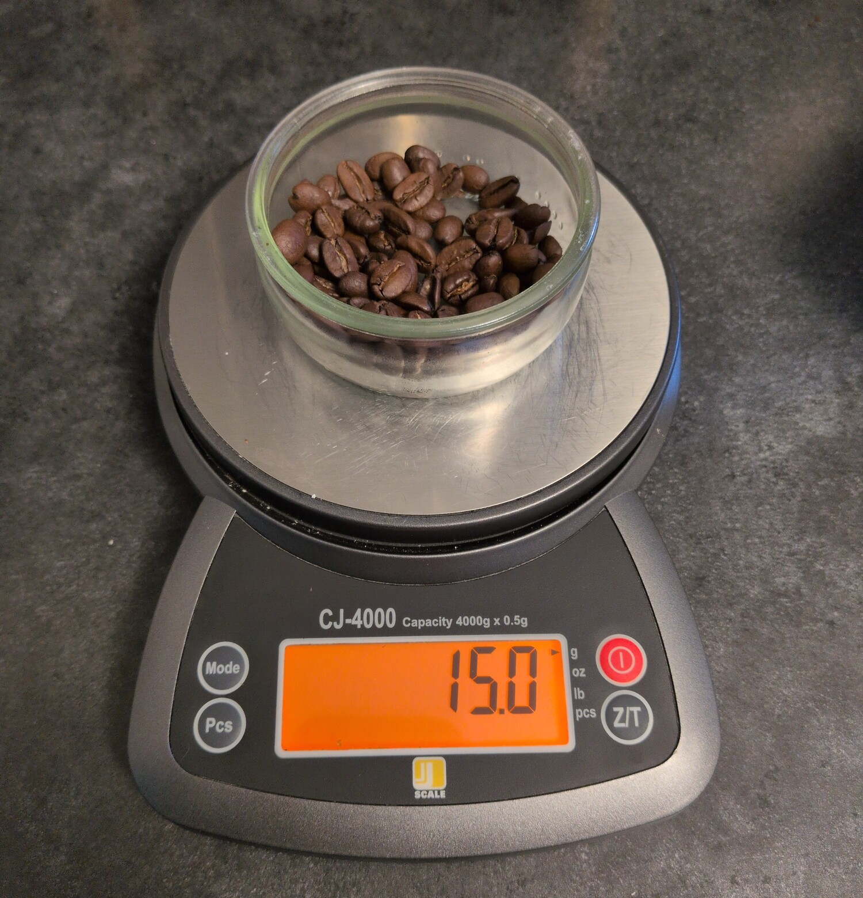
  <br>
  <em>Step 1: Weight the beans according to the recipe</em>
</p>
<p align="center">
  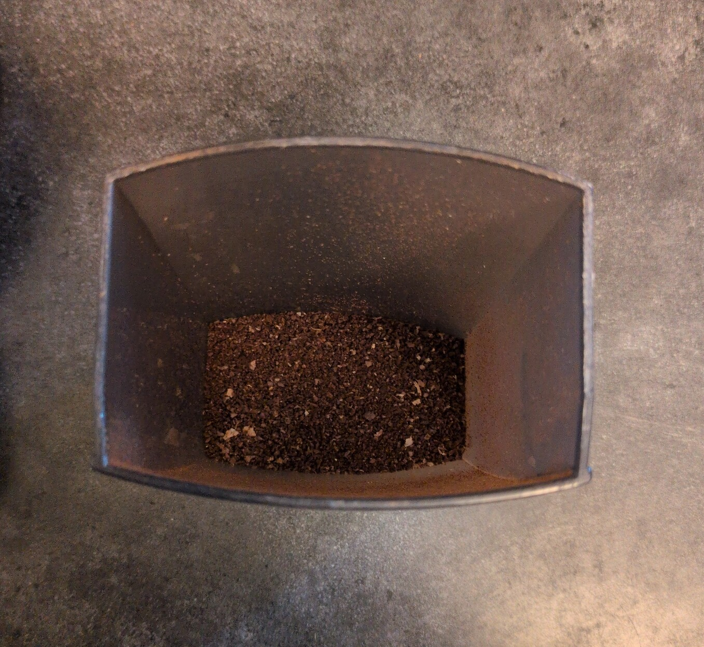
  <br>
  <em>Step 2: Grind the beans according to the recipe.</em>
</p>
<p align="center">
  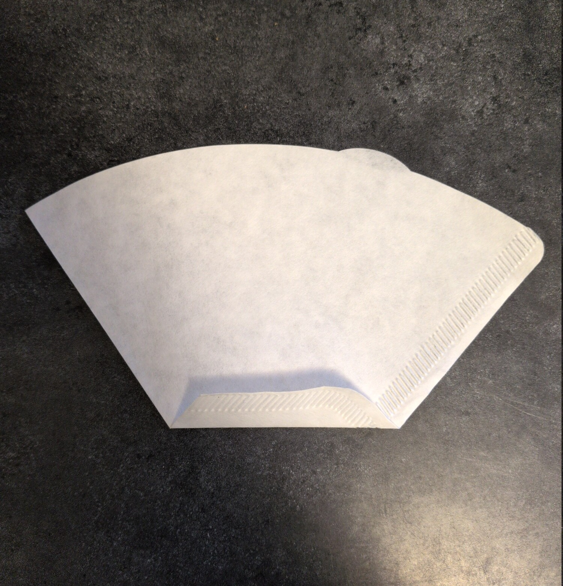
  <br>
  <em>Step 3: The comments call for reinforcing the seal in these filters with a fold to prevent blowing out.</em>
</p>
<p align="center">
  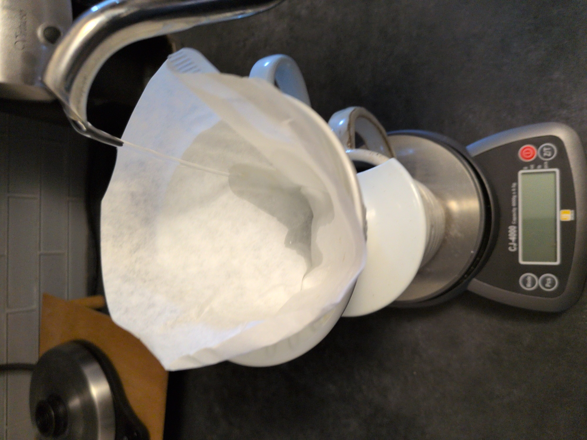
  <br>
  <em>Step 4: The comments also call to wet and warm the filter and mug before starting. Dump this waste water down the drain.</em>
</p>
<p align="center">
  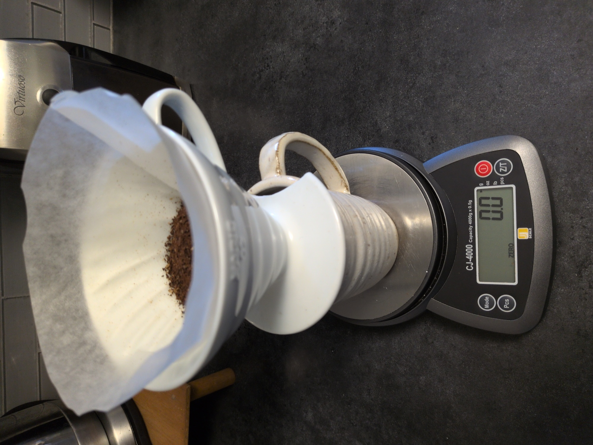
  <br>
  <em>Step 5: Zero the scale with the grounds ready.</em>
</p>
<p align="center">
  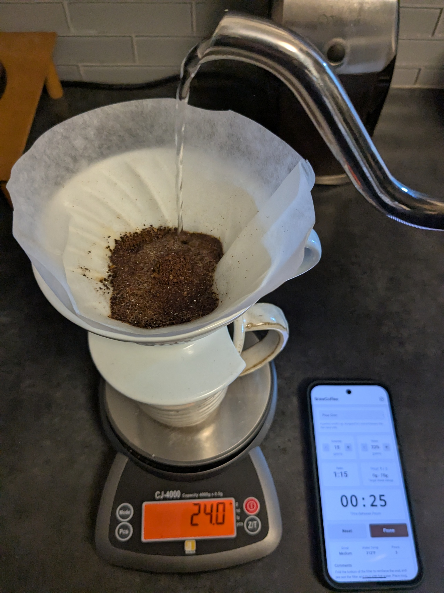
  <br>
  <em>Step 6: The first pour. The app tells me I am pouring from 0-75g of water this time.</em>
</p>
<p align="center">
  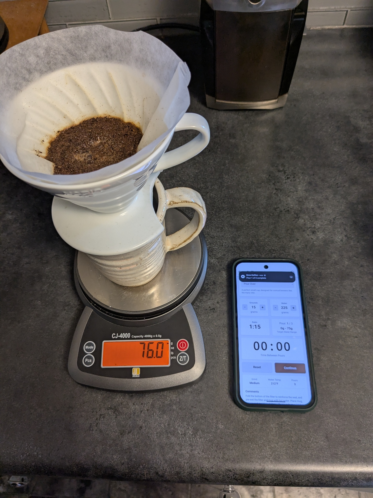
  <br>
  <em>Step 7: The timer has finished, time to move to the next pour.</em>
</p>
<p align="center">
  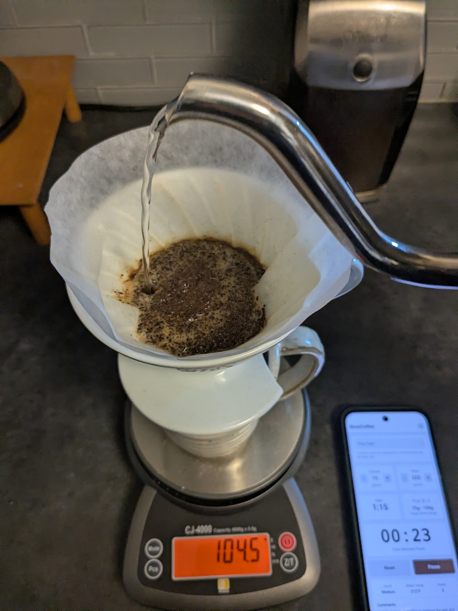
  <br>
  <em>Step 8: This time I know my range is from 75-150g.</em>
</p>
<p align="center">
  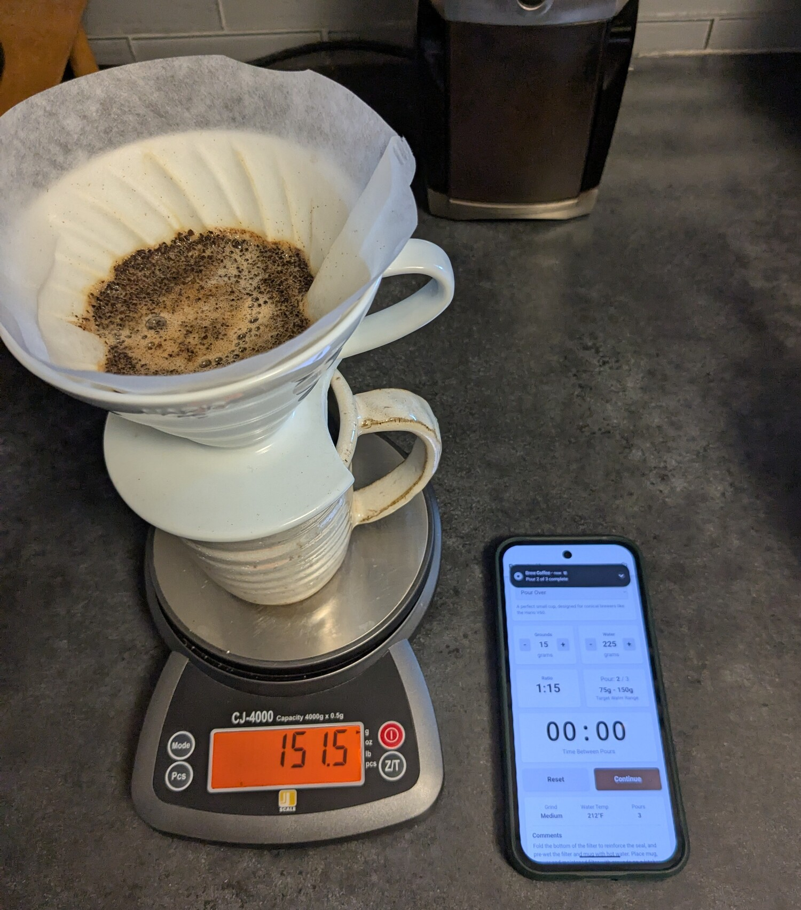
  <br>
  <em>Step 9: Pour is complete, moving to the final pour.</em>
</p>
<p align="center">
  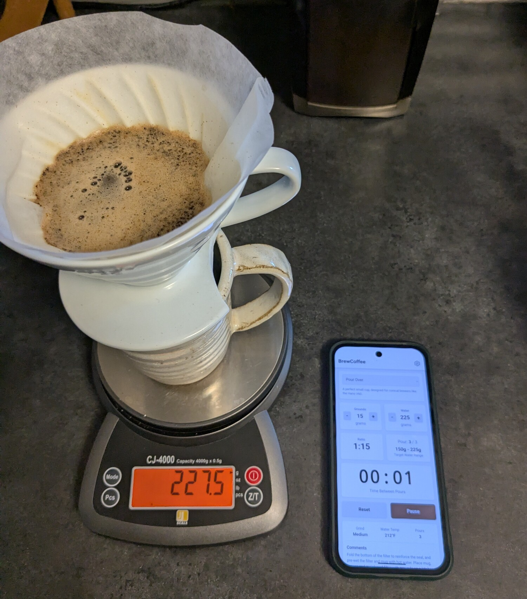
  <br>
  <em>Step 10: Brewing is finishing.</em>
</p>
<p align="center">
  
  <br>
  <em>Step 11: The final product. Noticably better results than an automatic machine.</em>
</p>

## Screenshots

<p align="center">
  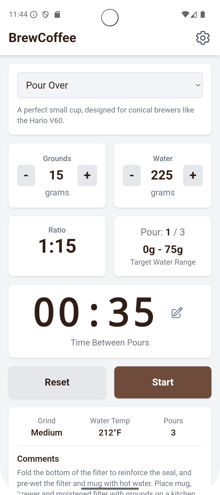
  <br>
  <em>Main Screen</em>
</p>
<p align="center">
  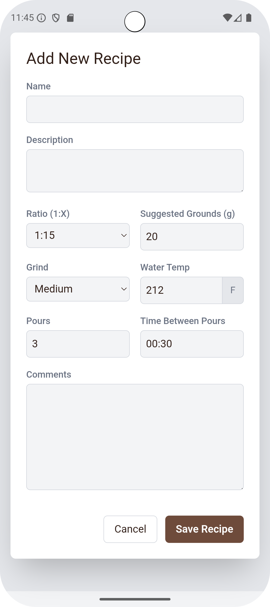
  <br>
  <em>New Recipe</em>
</p>
<p align="center">
  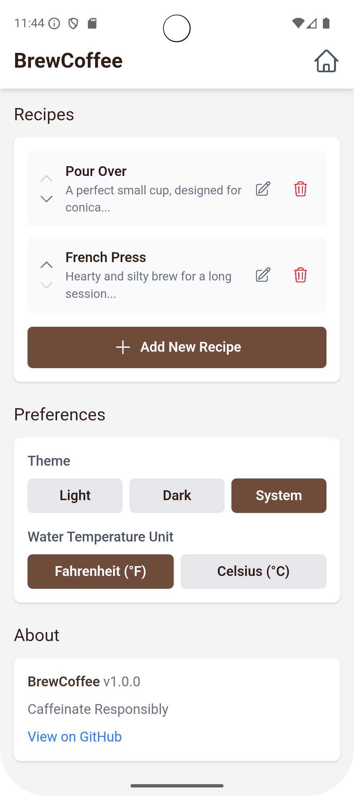
  <br>
  <em>Settings</em>
</p>
<p align="center">
  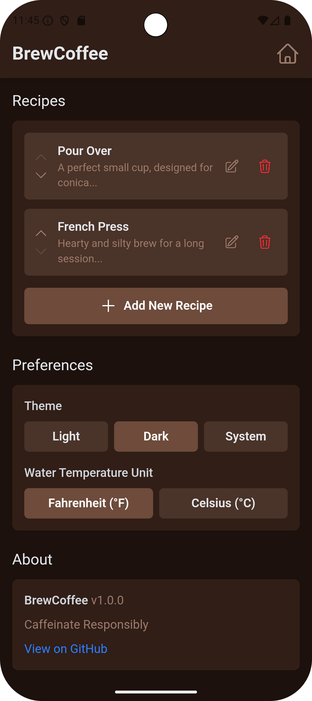
  <br>
  <em>Dark Theme</em>
</p>
<p align="center">
  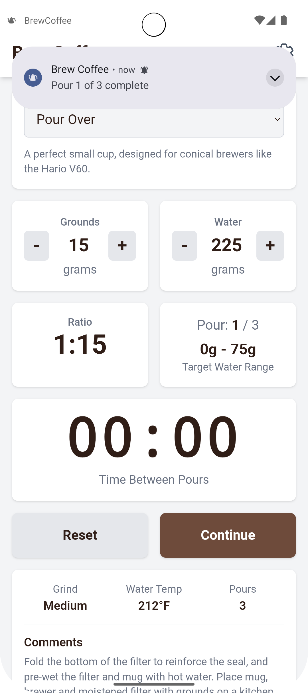
  <br>
  <em>Notification</em>
</p>

## Technologies

*   **React:** A JavaScript library for building user interfaces.
*   **Vite:** A fast build tool for modern web projects.
*   **TypeScript:** A typed superset of JavaScript that compiles to plain JavaScript.
*   **Tailwind CSS:** A utility-first CSS framework for rapidly building custom designs.
*   **Capacitor:** A cross-platform native runtime for web apps.

## Development

To get started, clone the repository and install the dependencies:

```bash
git clone <repository-url>
cd brewcoffee
npm install
```

To start the development server, run:

```bash
npm run dev
```

To build the project for production, run:

```bash
npm run build
```

## Android

To build and run the app on Android, you will need to have Android Studio installed.

First, sync the project with Capacitor:

```bash
npx cap sync android
```

Then, open the `android` directory in Android Studio and run the app on your device or an emulator.
